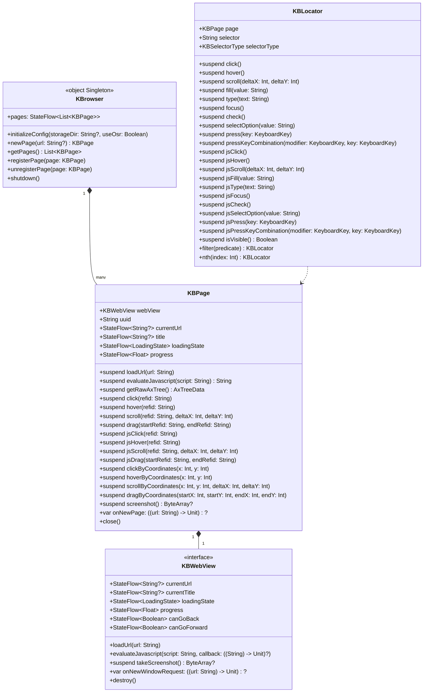

# KBrowser Architecture Design

> [← Back to README](../README.md)

English | [简体中文](KBrowser_Architecture_Design_zh.md)

---

## 1. Framework Positioning

KBrowser is a Compose Multiplatform (KMP) library providing cross-platform WebView components and programmatic browser automation. All public classes and interfaces use the `KB` prefix.

The framework is structured in two layers:
- **UI Component Layer** (`KBWebView` interface + `@Composable KBWebView`): A pure WebView component responsible for web rendering and display.
- **Automation Layer** (`object KBrowser` singleton + `KBPage`): A coroutine-based programmatic control wrapper around `KBWebView`. It abstracts thread details and can be safely called from any coroutine context.

On JVM/Desktop, the underlying engine is JetBrains CEF (JCEF) running in Remote mode. All interactions are conducted via the Chrome DevTools Protocol (CDP), without relying on AWT mouse events.

## 2. Core Class Diagram



## 3. Coordinate System

**Globally unified under CSS document pixels.**

| Scenario | Implementation | Description |
|----------|---------------|-------------|
| Click / Hover | CDP `Input.dispatchMouseEvent` | Dispatches viewport coordinates: `viewportX = docX - scrollX`, `viewportY = docY - scrollY` |
| Screenshot | CDP `Page.captureScreenshot` → scaled down by DPR | Output image dimensions = CSS pixel dimensions, 1:1 aligned with coordinates |
| AXTree Node Coordinates | CDP `Accessibility.getFullAXTree` + `DOM.getBoxModel` | `x/y/centerX/centerY` are all in CSS document pixels |
| Locator Positioning | JVM: CDP `DOM.querySelectorAll` / `DOM.performSearch` / `Accessibility.getFullAXTree` (no JS injection, CSP-safe); Android/iOS: JS fallback | Returned coordinates are also in CSS document pixels |

> There is no DPR scaling ambiguity. Screenshot coordinates match interaction coordinates exactly.

## 4. Rendering Modes (JVM Desktop)

On JVM, JCEF supports two rendering modes determined at initialization:

### Non-OSR Mode (Native Window, `useOsr = false`)

JCEF creates a native heavyweight window component. The browser renders directly through the native window system, providing better performance. However, the heavyweight component renders on top of all lightweight Swing/Compose components, making it impossible to overlay Compose UI on top of the JCEF view.

### OSR Mode (Off-Screen Rendering, `useOsr = true`)

JCEF renders into an off-screen buffer, and the result is painted as a lightweight component. This allows Compose UI to be layered on top of the JCEF view. However, mouse and keyboard events are dispatched to the underlying JCEF native view, not to overlay Compose components. Interactive Compose components placed over the JCEF area will not respond to user input.

This is a known issue with low priority. If you do not need to overlay Compose UI on the browser, use non-OSR mode for better performance and correct event handling.

### Automatic Fallback

If OSR initialization fails (e.g., missing native libraries), `OsrMode` automatically falls back to non-OSR mode for the entire application lifecycle. This is transparent to the caller.

## 5. Interaction Modes and Execution Paths

KBrowser provides two parallel interaction models, clearly separated by naming conventions:

### Coordinate Mode (Physical System Events)
* **API Examples**: `page.click(refid)`, `locator.click()`, `page.clickByCoordinates(x, y)`
* **Mechanism**: Resolves element coordinates from cache or locator, converts to viewport coordinates, and dispatches physical pointer events via CDP.
* **Pros**: Real physical pointer simulation, bypasses basic anti-bot detection.
* **Cons**: Susceptible to element occlusion or elements scrolled out of the viewport.

### JS Mode (DOM Event Simulation)
* **API Examples**: `page.jsClick(refid)`, `locator.jsClick()`, `locator.jsFill("val")`
* **Mechanism**: Resolves the element's CSS selector and directly executes JavaScript in the DOM.
* **Pros**: Immune to occlusion, overlap, or off-viewport issues. Precise value modification.
* **Cons**: Advanced anti-bot systems may detect synthetic events via `.isTrusted` flag.

## 6. Platform Requirements

| Platform | Minimum Version | WebView Implementation | Remarks |
|----------|----------------|----------------------|---------|
| JVM/Desktop | JBR with JCEF | `JvmWebView` wrapping JCEF | Must use JetBrains Runtime with JCEF; the library does not bundle JCEF |
| Android | API 34 (Android 14) | `AndroidWebView` wrapping system `WebView` | Uses androidx.webkit Multi-Profile API |
| iOS | iOS 17.0+ | `IosWebView` wrapping `WKWebView` | Uses `WKWebsiteDataStore(forIdentifier:)` for isolation |

**Initialization Order (JVM must strictly follow)**:
```kotlin
KBrowser.initializeConfig(storageDir = "/path/to/cache", useOsr = false)
runBlocking { initializeKBrowser() }
application { /* Compose UI */ }
```

## 7. Threading Model

- All `suspend` methods of `KBPage` internally switch to `Dispatchers.Main` via `withContext`, allowing them to be called from any coroutine context.
- Asynchronous callbacks (JS evaluation results, page load completion) are converted to suspended states using `suspendCancellableCoroutine` without blocking threads.
- CPU-intensive operations (`getCleanedAxTree`, `getViewportAxTree`) are pure Kotlin extension functions that execute in the caller's coroutine context.
- `KBrowser.pages` uses `MutableStateFlow` + `update {}` for atomic updates, ensuring safety across coroutines.
- Cancelled `loadUrl` coroutines automatically call `webView.stopLoading()`.
- `KBPage` node cache: write operations are serialized via `Mutex`, read operations use `@Volatile` for visibility. Reads never deadlock with writes.
