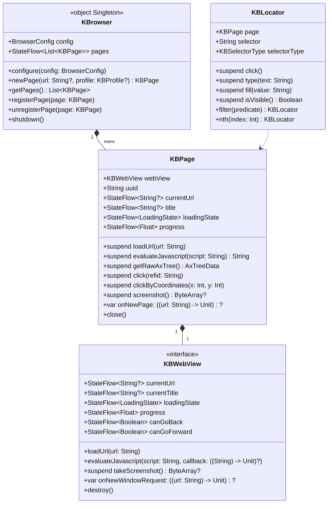

# KBrowser Architecture Design

> [← Back to README](../README.md)

English | [简体中文](KBrowser_Architecture_Design_zh.md)

---

## 1. Framework Positioning

KBrowser is a Compose Multiplatform (KMP) library providing cross-platform WebView components and programmatic browser automation. All public classes and interfaces use the `KB` prefix.

The framework is structured in two layers:
- **UI Component Layer** (`KBWebView` interface + `@Composable KBWebView`): Responsible for web rendering and display.
- **Automation Layer** (`object KBrowser` singleton + `KBPage`): Responsible for coroutine-based programmatic control. It abstracts thread details and can be safely called from any background coroutine context.

On JVM/Desktop, the underlying engine is JetBrains CEF (JCEF) running in Remote mode. All interactions are conducted via the Chrome DevTools Protocol (CDP), without relying on AWT mouse events.

## 2. Core Class Diagram



## 3. Coordinate System

**Globally unified under CSS document pixels.**

| Scenario | Implementation | Description |
|------|------|----------|
| Click / Hover | CDP `Input.dispatchMouseEvent` | Dispatches viewport coordinates: `viewportX = docX - scrollX`, `viewportY = docY - scrollY` |
| Screenshot | CDP `Page.captureScreenshot` → scaled down by DPR | Output image dimensions = CSS pixel dimensions, 1:1 aligned with coordinates, no black-screen issues |
| AXTree Node Coordinates | CDP `Accessibility.getFullAXTree` + `DOM.getBoxModel` | `x/y/centerX/centerY` are all in CSS document pixels |
| Locator Positioning | JVM: CDP `DOM.querySelectorAll` / `DOM.performSearch` / `Accessibility.getFullAXTree` (no JS injection, CSP-safe); Android/iOS: JS fallback | Returned coordinates are also in CSS document pixels |

> **Note**: There is no DPR scaling ambiguity. Screenshot coordinates match interaction coordinates exactly; pixel coordinates from screenshots can directly drive clicks.

## 4. Platform Requirements

| Platform | Minimum Version | WebView Implementation | Remarks |
|------|----------|-------------|------|
| JVM/Desktop | JBR 25 with JCEF | `JvmWebView` wrapping `JBCefBrowser` | Must use JetBrains Runtime 25; the framework does not bundle a JCEF downloader. |
| Android | API 34 (Android 14) | `AndroidWebView` wrapping system `WebView` | Uses androidx.webkit Multi-Profile API for sandbox isolation. |
| iOS | iOS 17.0+ | `IosWebView` wrapping `WKWebView` | Uses `WKWebsiteDataStore(forIdentifier:)` for persistent isolation. |

**JVM Headless Mode**: `JvmWebView` automatically creates a transparent `JFrame` (1280×800) and mounts the JCEF component on it in headless scenarios, eliminating the need to mount it manually in the Compose tree. A virtual display (e.g. `Xvfb`) is required on Linux servers.

**Initialization Order (JVM must strictly follow)**:
```kotlin
KBrowser.configure(BrowserConfig(storageDir = "/path/to/cache"))
initializeKBrowser()   // Must be called before application{}
application { /* Compose UI */ }
```

## 5. Threading Model

- All `suspend` methods of `KBPage` internally switch to the main thread via `withContext(Dispatchers.Main)`, allowing them to be safely called from any coroutine context.
- Asynchronous callbacks (JS evaluation results, page load completion) are converted to suspended states using `suspendCancellableCoroutine` without blocking threads.
- CPU-intensive operations (AXTree cleaning `getCleanedAxTree`, viewport cropping `getViewportAxTree`) are pure Kotlin extension functions that execute in the caller's coroutine context without occupying the main thread.
- `KBBrowser.pages` uses `MutableStateFlow` + `update {}` for atomic updates, ensuring safety across multiple coroutines.
- Cancelled `loadUrl` coroutines automatically call `webView.stopLoading()` to prevent residual network requests from interfering with subsequent actions.
