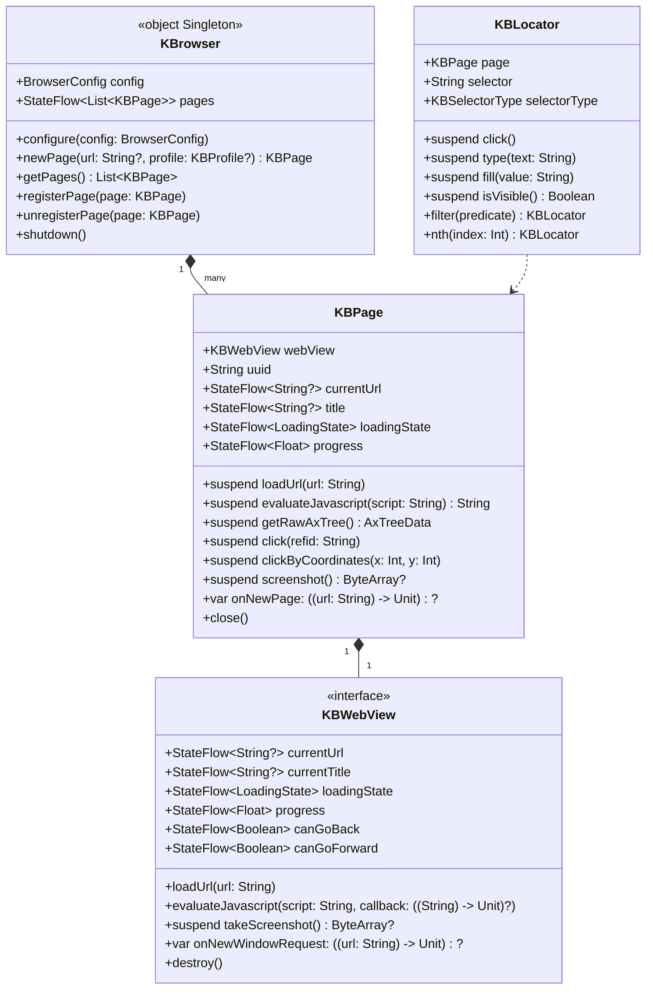

# KBrowser 架构设计

> [← 返回自述文件](../README_zh.md)

[English](KBrowser_Architecture_Design.md) | 简体中文

---

## 1. 框架定位

KBrowser 是一个 Compose Multiplatform (KMP) 库，提供跨平台的 WebView 组件与编程式浏览器自动化能力。所有公开类与接口统一使用 `KB` 前缀。

框架分为两层：**UI 组件层**（`KBWebView` 接口 + `@Composable KBWebView`）负责网页渲染与展示；**自动化控制层**（`object KBrowser` 单例 + `KBPage`）负责协程化的编程式控制，屏蔽底层线程细节，可在任意后台协程中安全调用。JVM/Desktop 平台底层使用 JetBrains CEF (JCEF) Remote 模式，所有交互通过 Chrome DevTools Protocol (CDP) 完成，不依赖 AWT 鼠标事件。

## 2. 核心架构图



## 3. 坐标系统说明

**全局统一使用 CSS 文档像素（CSS document pixels）。**

| 场景 | 实现 | 坐标说明 |
|------|------|----------|
| 点击 / 悬停 | CDP `Input.dispatchMouseEvent` | 传入视口坐标：`viewportX = docX - scrollX`，`viewportY = docY - scrollY` |
| 截图 | CDP `Page.captureScreenshot` → 按 DPR 缩小 | 输出图像尺寸 = CSS 像素尺寸，与坐标 1:1 对齐，无黑屏问题 |
| AXTree 节点坐标 | CDP `Accessibility.getFullAXTree` + `DOM.getBoxModel` | `x/y/centerX/centerY` 均为 CSS 文档像素 |
| Locator 定位 | JVM: CDP `DOM.querySelectorAll` / `DOM.performSearch` / `Accessibility.getFullAXTree`（无 JS 注入，CSP 安全）；Android/iOS: JS fallback | 返回坐标同为 CSS 文档像素 |

> **注意**：不存在 DPR 缩放歧义。截图坐标与交互坐标完全一致，可直接用截图像素坐标驱动点击。

## 4. 平台要求

| 平台 | 最低版本 | WebView 实现 | 备注 |
|------|----------|-------------|------|
| JVM/Desktop | JBR 25 with JCEF | `JvmWebView` 包装 `JBCefBrowser` | 必须使用 JetBrains Runtime 25，框架不内置 JCEF 下载器 |
| Android | API 34 (Android 14) | `AndroidWebView` 包装系统 `WebView` | 使用 androidx.webkit Multi-Profile API 实现沙盒隔离 |
| iOS | iOS 17.0+ | `IosWebView` 包装 `WKWebView` | 使用 `WKWebsiteDataStore(forIdentifier:)` 实现持久化隔离 |

**JVM 无头模式**：`JvmWebView` 在无头场景下自动创建透明 `JFrame`（1280×800）并将 JCEF 组件挂载其上，无需在 Compose 树中手动挂载。Linux 服务器需配置虚拟显示器（如 `Xvfb`）。

**初始化顺序（JVM 必须严格遵守）**：
```kotlin
KBrowser.configure(BrowserConfig(storageDir = "/path/to/cache"))
initializeKBrowser()   // 必须在 application{} 之前调用
application { /* Compose UI */ }
```

## 5. 线程模型

- `KBPage` 的所有 `suspend` 方法内部通过 `withContext(Dispatchers.Main)` 切回主线程执行，调用方可在任意协程上下文中使用。
- 异步回调（JS 执行结果、页面加载完成）通过 `suspendCancellableCoroutine` 转为挂起，不阻塞线程。
- CPU 密集型操作（AXTree 清洗 `getCleanedAxTree`、视口裁剪 `getViewportAxTree`）是纯 Kotlin 扩展函数，在调用方协程上下文执行，不占用主线程。
- `KBBrowser.pages` 使用 `MutableStateFlow` + `update {}` 原子更新，多协程并发安全。
- `loadUrl` 协程取消时自动调用 `webView.stopLoading()`，防止残余加载干扰后续操作。
