# KBrowser 架构设计

> [← 返回自述文件](../README_zh.md)

[English](KBrowser_Architecture_Design.md) | 简体中文

---

## 1. 框架定位

KBrowser 是一个 Compose Multiplatform (KMP) 库，提供跨平台的 WebView 组件与编程式浏览器自动化能力。所有公开类与接口统一使用 `KB` 前缀。

框架分为两层：
- **UI 组件层**（`KBWebView` 接口 + `@Composable KBWebView`）：纯净的 WebView 组件，负责网页渲染与展示。
- **自动化控制层**（`object KBrowser` 单例 + `KBPage`）：基于协程的 `KBWebView` 自动化封装，屏蔽底层线程细节，可在任意协程上下文中安全调用。

JVM/Desktop 平台底层使用 JetBrains CEF (JCEF) Remote 模式，所有交互通过 Chrome DevTools Protocol (CDP) 完成，不依赖 AWT 鼠标事件。

## 2. 核心架构图

```mermaid
classDiagram
    direction TB

    class KBrowser {
        <<object Singleton>>
        +initializeConfig(storageDir: String?, useOsr: Boolean)
        +newPage(profile: KBProfile?) KBPage
        +newHeadlessTab(profile: KBProfile?, viewportWidth: Int, viewportHeight: Int) KBPage
        +pages: StateFlow~List~KBPage~~
        +getPages() List~KBPage~
        +shutdown()
    }

    class KBPage {
        +KBWebView webView
        +String uuid
        +StateFlow~String?~ currentUrl
        +StateFlow~String?~ title
        +StateFlow~LoadingState~ loadingState
        +StateFlow~Float~ progress
        +suspend loadUrl(url: String)
        +suspend evaluateJavascript(script: String) String
        +suspend clearCacheAndCookies()
        +suspend setCookieViaJs(cookieString: String)
        +suspend snapshot(mode: SnapshotMode) SnapshotResult
        +suspend click(refid: String) OperationResult
        +suspend hover(refid: String)
        +suspend scroll(refid: String, deltaX: Int, deltaY: Int) OperationResult
        +suspend drag(startRefid: String, endRefid: String)
        +suspend jsClick(refid: String)
        +suspend jsHover(refid: String)
        +suspend jsScroll(refid: String, deltaX: Int, deltaY: Int)
        +suspend jsDrag(startRefid: String, endRefid: String)
        +suspend clickByCoordinates(x: Int, y: Int) OperationResult
        +suspend hoverByCoordinates(x: Int, y: Int)
        +suspend scrollByCoordinates(x: Int, y: Int, deltaX: Int, deltaY: Int) OperationResult
        +suspend dragByCoordinates(startX: Int, startY: Int, endX: Int, endY: Int)
        +suspend press(key: KeyboardKey)
        +suspend pressKeyCombination(modifier: KeyboardKey, key: KeyboardKey)
        +suspend typeChar(char: Char)
        +suspend type(text: String)
        +suspend uploadFile(refid: String, filePaths: List~String~)
        +suspend uploadFileBySelector(selector: String, filePaths: List~String~)
        +suspend screenshot() ByteArray?
        +locator(selector: String) KBLocator
        +getByRole(role, name?) KBLocator
        +getByText(text, exact) KBLocator
        +getByLabel(label) KBLocator
        +getByPlaceholder(text) KBLocator
        +getByAltText(text) KBLocator
        +getByTitle(title) KBLocator
        +getByTestId(testId) KBLocator
        +setInteractionLocked(locked: Boolean)
        +updateMouseTrail(viewportX: Int, viewportY: Int)
        +var onNewPage: ((url: String) -> Unit)?
        +var onFileDialog: ((request, callback) -> Unit)?
        +close()
        -suspend getRawAxTree() AxTreeData
        -nodeCacheWriteLock: Mutex
        -nodeCache: Map~String, AxNode~
    }

    class KBWebView {
        <<interface>>
        +StateFlow~String?~ currentUrl
        +StateFlow~String?~ currentTitle
        +StateFlow~LoadingState~ loadingState
        +StateFlow~Float~ progress
        +StateFlow~Boolean~ canGoBack
        +StateFlow~Boolean~ canGoForward
        +loadUrl(url: String)
        +loadHtml(html: String)
        +reload()
        +stopLoading()
        +goBack()
        +goForward()
        +evaluateJavascript(script: String, callback: ((String) -> Unit)?)
        +registerJsCallback(name, callback)
        +unregisterJsCallback(name)
        +registerJsHandler(name, handler)
        +unregisterJsHandler(name)
        +clearCacheAndCookies()
        +setWebViewClient(client?)
        +setWebChromeClient(client?)
        +suspend takeScreenshot() ByteArray?
        +setInteractionLocked(locked: Boolean)
        +updateMouseTrail(viewportX: Int, viewportY: Int)
        +var onNewWindowRequest: ((url: String) -> Unit)?
        +var onFileDialogRequest: ((request, callback) -> Unit)?
        +destroy()
    }

    class KBLocator {
        +KBPage page
        +String selector
        +KBSelectorType selectorType
        +String? name
        +Boolean exact
        +suspend click() OperationResult
        +suspend hover()
        +suspend scroll(deltaX: Int, deltaY: Int) OperationResult
        +suspend fill(value: String) OperationResult
        +suspend type(text: String) OperationResult
        +suspend focus()
        +suspend check()
        +suspend selectOption(value: String)
        +suspend press(key: KeyboardKey)
        +suspend pressKeyCombination(modifier: KeyboardKey, key: KeyboardKey)
        +suspend jsClick()
        +suspend jsHover()
        +suspend jsScroll(deltaX: Int, deltaY: Int)
        +suspend jsFill(value: String) OperationResult
        +suspend jsType(text: String) OperationResult
        +suspend jsFocus()
        +suspend jsCheck()
        +suspend jsSelectOption(value: String)
        +suspend jsPress(key: KeyboardKey)
        +suspend jsPressKeyCombination(modifier: KeyboardKey, key: KeyboardKey)
        +suspend isVisible() Boolean
        +suspend getText() String
        +suspend getAttribute(name: String) String?
        +suspend count() Int
        +suspend boundingBox() Rect?
        +filter(predicate) KBLocator
        +nth(index: Int) KBLocator
        +first() KBLocator
        +last() KBLocator
    }

    KBrowser "1" *-- "many" KBPage
    KBPage "1" *-- "1" KBWebView
    KBLocator ..> KBPage
```



## 3. 坐标系统

**全局统一使用 CSS 文档像素。**

| 场景 | 实现 | 说明 |
|------|------|------|
| 点击 / 悬停 | CDP `Input.dispatchMouseEvent` | 传入视口坐标：`viewportX = docX - scrollX`，`viewportY = docY - scrollY` |
| 截图 | CDP `Page.captureScreenshot` → 按 DPR 缩小 | 输出图像尺寸 = CSS 像素尺寸，与坐标 1:1 对齐 |
| AXTree 节点坐标 | CDP `Accessibility.getFullAXTree` + `DOM.getBoxModel` | `x/y/centerX/centerY` 均为 CSS 文档像素 |
| Locator 定位 | JVM: CDP `DOM.querySelectorAll` / `DOM.performSearch` / `Accessibility.getFullAXTree`（无 JS 注入，CSP 安全）；Android/iOS: JS 降级 | 返回坐标同为 CSS 文档像素 |

> 不存在 DPR 缩放歧义。截图坐标与交互坐标完全一致。

## 4. 渲染模式（JVM Desktop）

在 JVM 上，JCEF 支持两种渲染模式，在初始化时确定。**OSR（`useOsr = true`）为默认模式**——是唯一支持在浏览器上方叠加 Compose UI 的模式。非 OSR 是性能优先场景的逃生舱，前提是接受绝不在浏览器上方绘制任何 Compose UI。

### OSR 模式（离屏渲染，`useOsr = true`）— 默认

JCEF 渲染到离屏缓冲区，结果作为轻量级组件绘制。这允许 Compose UI 层叠在 JCEF 视图之上。但鼠标和键盘事件由底层 JCEF 原生视图接收，叠加的 Compose 组件不响应用户输入。这是已知问题，优先级较低。

OSR 每帧需要 GPU → CPU → GPU 像素往返，因此 CPU/GPU 开销高于非 OSR。

### 非 OSR 模式（原生窗口，`useOsr = false`）

JCEF 创建原生重量级窗口组件。浏览器通过原生窗口系统直接渲染，性能最佳。但重量级组件渲染在所有轻量级 Swing/Compose 组件之上，无法在其上方叠加 Compose UI。

**macOS 实时缩放限制**：在 macOS 上，拖拽窗口或分隔条边框时浏览器内容不会实时更新——松开后才会刷新。这是 CEF + Core Animation 的架构限制（live-resize 期间 AWT 事件队列被阻塞，Core Animation 不提交帧），无法从 Java/AWT 侧绕过。详见 [jcef-resize-fix-plan.md](jcef-resize-fix-plan.md)。尽管如此，非 OSR 仍是完全可用的显示模式（当不需要叠加 Compose UI 且需要极限渲染性能时已在生产中使用）。

### OSR 模式下的中文输入

OSR 模式下 CEF 没有原生窗口来检测焦点，中文输入需要两个条件同时满足：

1. **JVM 参数**：`--add-opens=jcef/com.jetbrains.cef.remote.browser=ALL-UNNAMED` 和 `--add-opens=jcef/com.jetbrains.cef.remote=ALL-UNNAMED`，用于打开 JCEF 内部类的反射访问权限（`ImeSetComposition` / `ImeCommitText` 通过反射调用）
2. **焦点同步**：嵌入方必须显式调用 `CefBrowser.setFocus(true)` 同步焦点状态。若焦点未同步，CEF 内部认为浏览器没有焦点，会静默丢弃所有 IME 请求，而 `sendKeyEvent` 不检查焦点所以英文正常——这是中文无法输入的根本原因

KBrowser 内部通过 `KBCefInputMethodAdapter`（IME 事件转发）和 `ensureCefFocus()`（焦点同步）实现了完整的 OSR 中文输入支持。Non-OSR 模式下 JCEF 使用原生窗口，IME 由操作系统原生处理，不存在此问题。

### 自动降级

若 OSR 初始化失败（如缺少原生库），`OsrMode` 会自动降级到非 OSR 模式，整个应用生命周期内不再重试。对调用方透明。

## 5. 交互模式与执行路径

KBrowser 提供两套并行的交互模型，通过命名约定清晰区分：

### 坐标模式（物理事件）
* **API 示例**：`page.click(refid)`，`locator.click()`，`page.clickByCoordinates(x, y)`
* **机制**：从缓存或定位器解析元素坐标，转换为视口坐标，通过 CDP 分发物理指针事件。
* **优势**：真实物理指针模拟，可通过基本反爬虫检测。
* **劣势**：容易受元素遮挡或元素移出视口的影响。

### JS 模式（DOM 事件模拟）
* **API 示例**：`page.jsClick(refid)`，`locator.jsClick()`，`locator.jsFill("val")`
* **机制**：解析元素的 CSS 选择器，直接在 DOM 中执行 JavaScript。
* **优势**：无视遮挡、视口外问题，精准修改值。
* **劣势**：高级反爬虫系统可能通过 `.isTrusted` 标志检测合成事件。

## 6. 平台要求

| 平台 | 最低版本 | WebView 实现 | 备注 |
|------|----------|-------------|------|
| JVM/Desktop | 包含 JCEF 的 JBR | `JvmWebView` 封装 JCEF | 必须使用包含 JCEF 的 JetBrains Runtime，库不内置 JCEF |
| Android | API 34 (Android 14) | `AndroidWebView` 封装系统 `WebView` | 使用 androidx.webkit Multi-Profile API |
| iOS | iOS 17.0+ | `IosWebView` 封装 `WKWebView` | 使用 `WKWebsiteDataStore(forIdentifier:)` 实现隔离 |

**初始化顺序（JVM 必须严格遵守）**：
```kotlin
KBrowser.initializeConfig(storageDir = "/path/to/cache", useOsr = true) // 默认；仅在不叠加 Compose UI 且需极限性能时设为 false
runBlocking { initializeKBrowser() }
application { /* Compose UI */ }
```

## 7. 线程模型

- `KBPage` 的所有 `suspend` 方法内部通过 `withContext(Dispatchers.Main)` 切换到主线程执行，可在任意协程上下文中安全调用。
- 异步回调（JS 执行结果、页面加载完成）通过 `suspendCancellableCoroutine` 转为挂起，不阻塞线程。
- CPU 密集型操作（`AxTreeData.getCleanedAxTree()`、`AxTreeData.toYamlSnapshot()`）是纯 Kotlin 扩展函数，在调用方协程上下文执行，不切换线程。`getCleanedAxTree()` 实际行为是过滤出当前视口内的节点（与 `toYamlSnapshot(VIEWPORT)` 使用相同的视口范围判定）。
- `KBrowser.pages` 使用 `MutableStateFlow` + `update {}` 原子更新，多协程并发安全。
- `loadUrl` 协程取消时自动调用 `webView.stopLoading()`。
- `KBPage` 节点缓存：写操作通过 `Mutex` 串行化，读操作使用 `@Volatile` 保证可见性。读操作不会因写操作持锁而死锁。
