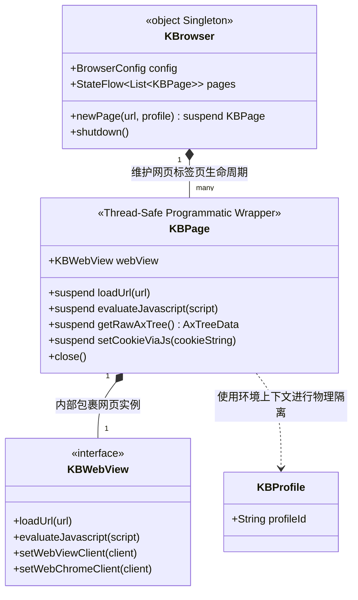

# KBrowser 架构设计文档 (Architecture Design Document)

## 1. 框架定位与命名规范
KBrowser 是一个**纯粹的 Compose Multiplatform (CMP) 库**，而不是一个独立的应用程序。它定位于提供跨平台的“Webview 组件及编程式浏览器网页管理框架”。所有暴露的核心类与接口统一使用 `KB` 作为前缀。

本框架在设计上正式将**“前端 UI 视图渲染”**与**“后台编程式控制”**剥离开来，提供两层不同维度的 API：
1. **独立 UI 组件层 (`KBWebView` & `@Composable KBWebView` 视图组件)**：最纯粹的网页渲染控件，使用方式和平台直觉（如 iOS 的 `WKWebView`、Android 的 `WebView`）完全一致。基于 Compose 规范，由开发者直接实例化与控制 `KBWebView` 并设置其代理回调，由 `@Composable KBWebView` 将其挂载展示。
2. **编程式页面控制层 (`object KBrowser` & `KBPage`)**：针对需要后台运行、协程同步顺序调用以及自动化网页操作等复杂业务场景设计。彻底屏蔽底层线程依赖，允许在任意后台协程中运行。**注意：为确保底层引擎正常激活，KBPage 底层的 KBWebView 必须挂载至 Compose 树中（无头模式下可挂载为不可见或 0.dp）**。
   > [!NOTE]
   > **系统特性限制说明**：受系统特性及底层组件限制，无法实现完全脱离窗口的“真无头”。在 Desktop (JVM) 平台下，底层的 JCEF 必须依赖 Swing Panel 及其宿主窗口进行初始化与事件调度。因此，本框架的无头模式仅仅是在底层隐式实例化控件，并通过设置窗口透明或隐藏等方式使其视觉上不可见。

> [!CAUTION]
> **绝对的懒加载架构底线（必须遵守）**
> **严禁在应用程序启动阶段（如 `main` 函数）或全局初始化代码中，执行预加载或主动唤醒浏览器内核（如显式调用 `KBCefApp.getInstance()` 或其实例化行为）。**
> 
> **为什么必须遵守：**
> 1. **架构定位**：KBrowser 只是一个提供浏览器引擎支持的**库（Library）**，它可能被宿主应用引入但用户未必会打开相关的网页。如果宿主 APP 一启动就强行启动 Chromium 引擎，会导致巨额的内存与性能开销。
> 2. **独立多进程隔离**：启动 JCEF 时会立刻 Spawn 出多个独立进程（如 Renderer / GPU 子进程），导致用户刚打开一个普通界面，活动监视器就出现一堆冗余进程。
> 3. **解决方案**：浏览器引擎的加载（`KBCefApp` 等）必须**绝对被动（Lazy Initialization）**，即：**只有当用户切实进入了包含 `KBWebView` 的 Compose 界面（如其实例化对应的 ViewModel），系统才允许顺势触发其底层单例。**后续任何代码如果破坏这个底线（例如为了“优化第一次打开速度”而去 `main` 函数里写了句 `getInstance`），将会直接导致严重架构违规！

---

## 2. 核心架构图 (Architecture Structure)


**单例设计与生命周期语义强制声明：**
由于在 JVM 桌面端平台中，底层的 `CefApp` 全局只能被初始化且只能启动一次。因此，顶层调度者 `KBrowser` 必须被严格设计为 Kotlin 的 `object` 全局单例。
- `KBPage.close()`：销毁具体的标签页并释放其占据的 `KBWebView` 实例内存。
- `KBrowser.shutdown()`：关闭所有存活的 `KBPage`，并彻底销毁底层引擎（如调用 `CefApp.dispose()`）。**注意：一旦调用此方法，在 Desktop/JVM 平台的当前进程生命周期内，该单例将永久失效，绝不可再次重新唤醒使用。**

---

## 3. 环境隔离机制与多端系统要求 (Profile Isolation & Requirements)

`KBProfile` 的核心价值在于强制底层浏览器内核切分开独立的数据沙盒（Cookie、缓存等），实现真正的“多账号防串号”。经确认，项目强制采用极高的现代操作系统底线，以确保隔离机制的 100% 成功率。

*   **iOS 平台 (严格强制：iOS 17.0+)**：利用苹果最新的 `WKWebsiteDataStore(forIdentifier:)` API 实现彻底的磁盘持久化物理隔离。
*   **Android 平台 (严格强制：Android 14 / API 34+)**：利用 `androidx.webkit` 的 **Multi-Profile API**。后续开发第一阶段即将 `libs.versions.toml` 中的 `android-minSdk` 强行拉高至 34。保证系统内置的 WebView 核心绝对高于 M114 版本，实现完美的安卓端多环境隔离。
*   **Desktop 平台 (JVM) (严格强制：JBR 25 with JCEF)**：
    - **底层实现**：将 Profile 映射为底层 JCEF 的 `cache_path` 目录，引擎自动在硬盘上物理隔离。
    - **环境要求**：框架**不会**内置 JCEF 下载器。开发者在引入本库时，**必须且仅能使用 JetBrains 官方提供的带有 JCEF 模块的 JBR 25 (JetBrains Runtime 25 with JCEF)** 作为项目的运行环境。
    - **AWT/Swing 强绑定限制**：因为 JCEF 的渲染视图（`JBCefBrowser` UI 组件）是原生的 AWT/Swing 组件，所以在 Compose Multiplatform 中**必须挂载在 `SwingPanel` 上**才能渲染。由此导致即便在无头（Headless）模式下，也需要隐式建立 AWT 窗口环境，若要在没有物理屏幕的 Linux 服务器上运行，必须配置虚拟显示器（如 `Xvfb`），否则会因缺少图形排发环境引发 `HeadlessException` 崩溃。

---

## 4. 编程式页面封装与线程防弹机制 (KBPage Design)

`KBPage` 是对底层原生 `KBWebView` 的二次编程式包装，它主要通过 Kotlin 协程解决以下三个底层痛点：

1. **充当“线程防弹衣”，杜绝多端跨线程死锁与崩溃：**
   无论是 Desktop 端 JCEF（高度依赖 AWT EDT 线程），还是 Android/iOS 宿主，直接在后台线程操作 UI 控件均会导致崩溃或死锁。`KBPage` 作为隔离层，在内部将所有调用通过 `withContext(Dispatchers.Main)` 自动、安全地切回 UI 主线程执行，并把结果传回调用线程。调用者可以在任意后台协程中放心调用。
2. **抹平底层回调地狱，实现纯同步感知写法 (`suspend`)：**
   原生 WebView 的接口多为碎片化的异步回调。例如执行 JS 必须传入 Callback，等待网页加载完需要监听事件。`KBPage` 使用 `suspendCancellableCoroutine` 将这些异步事件抹平，调用方只需调用 `page.loadUrl(...)` 就会在协程上挂起并等待，拿到结果就像写本地同步代码一样直观。
3. **划分“纯 UI 视图层”与“非视觉逻辑层”的职责界限：**
   * **`KBWebView`**：最纯粹的底层网页渲染核心，专注于通过 `@Composable KBWebView` 进行前台界面展示。
   * **`KBPage`**：脱离视觉呈现的控制实体。它在内部隐藏了数据清洗、 refid 字典注入、坐标映射转换等逻辑细节，对外的 API 更加干净 and 简洁。

> [!CAUTION]
> **视图组合与职责分离底线（绝对不可越权）**
> **底层的 `KBWebView` 就是最纯粹的 WebView，绝对不允许夹带任何“遮罩”、“事件吞噬”或“自动化监控”等业务逻辑（更严禁修改底层 AWT/Swing 源码缝合 JPanel）。**
> 
> 高级控制特性必须完全在 **Compose 业务层** 通过视图组合（Composition）实现：
> 在 Compose 层，`KBPage` 的 UI 呈现应该是一个标准容器（`Box` / `ZStack`）。
> 1. **底层**：放置干干净净的 `@Composable KBWebView`。
> 2. **顶层**：根据 `KBPage` 的 `enableMask` 状态，叠加渲染纯 Compose 实现的 `@Composable KBMask`。
> 利用 Compose 层叠与事件分发机制，让顶层的 Mask 吞噬物理事件并渲染波纹动画，彻底与底层引擎解耦。

**树的提取与交互使用示例：**
```kotlin
launch(Dispatchers.IO) {
    // KBrowser 是全局 object 单例，代表浏览器应用
    val page = KBrowser.newPage("https://example.com", KBProfile("user_123")) 
    
    // 如果发生切号，调原生 API 强制清除当前沙盒缓存
    page.clearCacheAndCookies()
    
    page.loadUrl("https://example.com/login") 
    page.setCookieViaJs("token=abc; path=/")
    
    // 1. 获取全量原始树：切入 UI 主线程，向 JS 发送指令。
    // 底层不污染 DOM，纯在 JS 内存中建立 refid -> DOM Element 的字典映射，并返回。
    val rawTree = page.getRawAxTree() 
    
    // 2. 清洗原始树：解耦出来的纯 Kotlin 扩展函数！在当前 IO 线程直接计算。
    val cleaned = rawTree.getCleanedAxTree() 
    
    // 3. 裁剪可视区域：纯 Kotlin 扩展函数！在当前 IO 线程基于坐标碰撞裁剪。
    val viewport = cleaned.getViewportAxTree() 
    
    // 4. 精准交互：拿着获取的 refid 告诉 JS，JS 在内存字典里取出对应的 Element 对象执行 click()。
    try {
        page.clickByRefId(viewport.nodes.first().refid)
    } catch (e: ElementNotFoundException) {
        // 节点不存在，由上层调用者自己决定是否重新获取快照
    }
}
```

### 4.1 多线程并发安全与非阻塞设计规范 (Concurrency & Non-blocking Specs)

为了在开发阶段彻底杜绝因底层事件调度不当导致的多标签卡死、线程阻塞及数据冲突，多端实现必须严格遵循以下线程规范：

1. **多 Page 实例绝对独立，互不阻塞与干扰**：
   * 每一个 `KBPage` 实例（包含其持有的 `KBWebView`）在物理和数据通道上都是完全自治的。
   * 任何对 `pageA` 的操作（如加载网页、注入脚本、执行点击）必须被视为独立事件流，在底层绝不能因等待全局状态或锁而阻塞 `pageB` 的并行操作。
   * **绝对无锁化单页控制**：`KBPage` 内部**严禁使用 Mutex 锁**。所有操作指令必须通过 `withContext(Dispatchers.Main)` 统一切回主线程。主线程自身的事件循环队列已天然保证了操作的串行化与 UI 安全。对于业务防重（如连续触发 `loadUrl`），应通过协程 `Job.cancel()` 打断前置任务来处理，坚决防止锁住整个页面的挂起等待死锁。
2. **协程挂起 (`Suspend`) 代替线程阻塞 (`Blocking`)**：
   * 所有等待网页回调的操作，必须使用 Kotlin 协程的挂起机制（如 `suspendCancellableCoroutine`），利用事件回调触发 `continuation.resume` 恢复执行。
   * **严禁在任何地方使用阻塞线程的同步手段**（如 `Thread.sleep()`、`CountDownLatch.await()`、`runBlocking` 或强行在主线程 `Future.get()` 阻塞死等）。这保证了即使数十个 `KBPage` 共享同一个协程线程池（如 `Dispatchers.IO`），一个页面的加载等待也绝不会拖累或卡死该线程上的其他页面或操作。
3. **避免卡死 UI 主线程 (AWT EDT)**：
   * 所有底层渲染与排发指令必须快速投递并返回，UI 主线程仅作“指令分发邮局”，不能滞留。
   * 所有 CPU 密集型任务（如 AX 树数据清洗过滤、坐标坐标碰撞计算、复杂 JSON 反序列化等）必须作为普通纯函数或扩展函数实现，强制在调用者的协程上下文（如 `Dispatchers.Default` 或 `Dispatchers.IO`）上计算，绝对禁止放在 UI 主线程（或 JVM 端的 AWT EDT 线程）中运行。
4. **关键线程避坑与并发安全实现 checklist**：
   * **`KBrowser.pages` 状态流原子更新**：作为多标签页浏览器的核心数据源，页面集合必须使用 `MutableStateFlow<List<KBPage>>`，并使用 `update {}` 进行无锁化的原子更新。这不仅天然解决了跨协程并发读写的安全问题，又能直接驱动 Compose 界面响应式重组。
   * **`loadUrl` 挂起取消时中断原生加载**：当 `KBPage.loadUrl` 协程被取消时，必须在 `invokeOnCancellation` 中调用 `webView.stopLoading()` 强制停止原生浏览器加载，以防残余的未决页面加载干扰该实例后续的请求。
   * **JS 回调线程归一化（统一调度至主线程）**：由于各平台底层原生 JS 回调线程不同（iOS 在主线程，Android 在 `JavaBridge` 线程，JVM/JCEF 在底层 IPC 线程），框架必须保证向开发者暴露的回调触发时统一切换至 `Dispatchers.Main`，防止因跨线程更新 UI 导致多端行为不一致或闪退。
   * **JVM 实体类内回调 Map 并发安全**：`JvmWebView` 实现中的 `jsCallbacks` 映射表由于存在跨线程读写，必须使用 `ConcurrentHashMap` 代替普通 `HashMap`。

---

## 5. 待实现核心 API 清单 (Exposed APIs)

框架对外暴露的所有核心 API。

### 5.1 UI 组件基础接口 (声明式容器模式)

**A. 核心接口 (`interface KBWebView`)**
平台无关的普通 Kotlin 接口。包含了基础原生操作与响应式 Compose 状态：
- **Compose 响应式状态 (StateFlow 观测机制，UI 地址栏/进度条等强依赖)**:
  - `val currentUrl: StateFlow<String?>`
  - `val currentTitle: StateFlow<String?>`
  - `val loadingState: StateFlow<LoadingState>` (用于观测加载中/成功/失败状态)
  - `val progress: StateFlow<Float>` (0.0f ~ 1.0f 进度反馈)
  - `val canGoBack: StateFlow<Boolean>`
  - `val canGoForward: StateFlow<Boolean>`
- **基础命令操作**:
  - `loadUrl(url: String)`: 加载网络地址。
  - `loadHtml(html: String)`: 加载纯 HTML 字符串。
  - `reload()`, `goBack()`, `goForward()`, `stopLoading()`: 标准导航控制集合。
  - `evaluateJavascript(script: String, callback: ((String) -> Unit)?)`: 执行原生 JS。
  - `clearCacheAndCookies()`: 清理当前会话下所有的缓存与原生 Cookie 状态（切换账号必需）。
- **JS <-> Native 原生通信通道**:
  - `fun registerJsCallback(name: String, callback: (String) -> Unit)`
  - `fun unregisterJsCallback(name: String)`
- **回调代理设置**:
  - `setWebViewClient(client: KBWebViewClient?)`
  - `setWebChromeClient(client: KBWebChromeClient?)`

**B. 跨平台最小公共子集回调代理**
屏蔽三端系统的复杂差异，对外仅抽象暴露以下核心最小公共子集：
- `interface KBWebViewClient`:
  - `fun onPageStarted(url: String)`
  - `fun onPageFinished(url: String)`
  - `fun onReceivedError(error: Diagnostics)` (统一错误描述映射)
- `interface KBWebChromeClient`:
  - `fun onJsAlert(url: String, message: String, callback: JsResultCallback)`
  - `fun onJsConfirm(url: String, message: String, callback: JsResultCallback)`
  - `fun onJsPrompt(url: String, message: String, defaultValue: String?, callback: JsPromptResultCallback)`
  - `fun onPermissionRequest(request: PermissionRequest)`

**C. Compose 专属挂载口与工厂**
- `@Composable expect fun rememberKBWebView(initialUrl: String? = null, profile: KBProfile? = null): KBWebView`: UI 组装期间用于实例化各端网页实例的工厂。
- `@Composable expect fun KBWebView(webView: KBWebView, modifier: Modifier = Modifier)`: 跨平台的视图挂载入口。

**D. 纯 UI 组件层直接使用示例 (直觉对齐 iOS/Android)**
直接操作 `KBWebView` 并绑定代理，无需任何 `KBPage` 包装的极简浏览器页面写法：
```kotlin
@Composable
fun MyBrowserScreen() {
    // 1. 实例化与控制 KBWebView (完全对齐平台原生直觉，支持传入 KBProfile 进行独立沙盒隔离)
    val webView = rememberKBWebView(
        initialUrl = "https://example.com",
        profile = KBProfile("custom_user_session") // 可选：指定独立沙盒隔离 Cookie/缓存
    )
    
    // 2. 设置代理回调
    LaunchedEffect(webView) {
        webView.setWebViewClient(object : KBWebViewClient {
            override fun onPageStarted(url: String) {
                println("网页开始加载: $url")
            }
            override fun onPageFinished(url: String) {
                println("网页加载完毕: $url")
            }
            override fun onReceivedError(error: Diagnostics) {
                println("加载出错: ${error.description}")
            }
        })
    }
    
    Column(modifier = Modifier.fillMaxSize()) {
        // 3. 挂载展示容器
        KBWebView(
            webView = webView,
            modifier = Modifier.weight(1f)
        )
        
        // 4. 直接通过 API 发送控制指令
        Row {
            Button(onClick = { webView.goBack() }) { Text("后退") }
            Button(onClick = { webView.goForward() }) { Text("前进") }
            Button(onClick = { webView.reload() }) { Text("刷新") }
        }
    }
}
```

### 5.2 自动化核心接口 (`KBPage` - 全协程流水线)
提供给爬虫与后端自动化工程师调用的高级 API，彻底抹平异步回调。

#### A. 核心 DOM 树提取管线 (AxTree Pipeline)
数据的采集与加工严格分离，防卡顿：
- `suspend fun getRawAxTree(): AxTreeData`: 利用 JS 一次性从浏览器内核采集全量 DOM。在采集时，底层逻辑必须为页面中的每一个节点自动分配一个在 **JS 内存中唯一** 的 `refid` 烙印（绝不允许注入 `data-kb-refid` 到真实的 HTML DOM 上，防止触发 `MutationObserver` 导致爬虫被封）。
- `fun AxTreeData.getCleanedAxTree(): AxTreeData`: 【纯 Kotlin 扩展函数】执行白名单与信噪比清洗。不绑定 KBPage，纯算力。
- `fun AxTreeData.getViewportAxTree(): AxTreeData`: 【纯 Kotlin 扩展函数】执行几何坐标碰撞裁剪。不绑定 KBPage，纯算力。

#### B. 自动化交互事件体系 (Interaction Events)
针对所有物理交互（点击、滚动、悬停、拖拽），统一提供双轨制目标定位（基于内存唯一标识 `refid` 或 物理坐标 `Coordinates`）。
- **【异常说明】**：如果在调用基于 `refid` 的方法时，底层发现该标识符不存在，直接挂起并抛出通用的 `ElementNotFoundException`。框架仅忠实执行指令，绝不替上层进行自作主张的异常重试封装。
- **点击 (Click)**
  - `suspend fun clickByRefId(refid: String)`: JS 在内存 Map 中通过 `refid` 找到对应的 DOM Element 对象直接执行原生行为。
  - `suspend fun clickByCoordinates(x: Int, y: Int)`: 发送真实的物理操作事件，进行基于系统底层的绝对像素坐标点击。
- **悬停 (Hover)**
  - `suspend fun hoverByRefId(refid: String)`
  - `suspend fun hoverByCoordinates(x: Int, y: Int)`
- **滚动 (Scroll)**
  - `suspend fun scrollByRefId(refid: String, deltaX: Int, deltaY: Int)`: 指定特定的内部可滚动元素触发滚动。
  - `suspend fun scrollByCoordinates(x: Int, y: Int, deltaX: Int, deltaY: Int)`: 在指定坐标位置触发滚动事件。
- **拖拽 (Drag & Drop)**
  - `suspend fun dragByCoordinates(startX: Int, startY: Int, endX: Int, endY: Int)`: 必须原生模拟物理长按与路径滑动。

#### C. 基础操控与注入
- `suspend fun loadUrl(url: String)`: 挂起直至页面加载完毕。
- `suspend fun evaluateJavascript(script: String): String`: 执行 JS 并死等回调结果。
- `suspend fun clearCacheAndCookies()`: 调用底层清理机制肃清隔离状态。
- `suspend fun setCookieViaJs(cookieString: String)`: 为当前的独立环境安全注入 Cookie。
- `suspend fun setMaskEnabled(enabled: Boolean)`: **【仅限 Desktop 端生效】** 开启/关闭桌面端防干扰鼠标屏蔽罩（移动端无视此调用）。

---

## 6. 跨平台代码结构清单 (KMP Structure Checklist)

基于 KMP，各目录严格职权划分如下：

### 6.1 `commonMain` (100% 共享)
- **数据结构**: `AxTreeData.kt`, `AxNode.kt` (包含 `refid` 字段), `Diagnostics.kt`, `BrowserConfig.kt`, `KBProfile.kt`, `ElementNotFoundException.kt`, `LoadingState.kt` 等辅助状态枚举。
- **核心算法**: `AxTreeCleaner.kt` (存放 `getCleanedAxTree` 和 `getViewportAxTree` 这两个独立扩展函数)
- **JS 注入库**: `JsScripts.kt` (DOM 提取打内存 `refid` 与坐标转换核心源码，基于标准 Web API 三端通用)
- **顶层调度**: `object KBrowser.kt`, `KBPage.kt` (自动化协程封装层)
- **UI 抽象接口**: `interface KBWebView.kt`, `KBWebViewClient.kt`, `KBWebChromeClient.kt`

### 6.2 `expect/actual` (平台桥接层)
- **`commonMain` (声明)**: 
  - `@Composable expect fun rememberKBWebView(initialUrl: String? = null, profile: KBProfile? = null): KBWebView`
  - `@Composable expect fun KBWebView(webView: KBWebView, modifier: Modifier = Modifier)`
- **`jvmMain` (实现)**: `JvmWebView` 包装 `JBCefBrowser`。Compose 使用 `SwingPanel` 挂载，组装 AWT `MouseEvent` 派发。
- **`androidMain` (实现)**: `AndroidWebView` 包装 `android.webkit.WebView`，结合 `ProfileStore` 隔离沙盒。Compose 使用 `AndroidView` 挂载，换算 Density 投递 `MotionEvent`
- **`iosMain` (实现)**: `IosWebView` 包装 `WKWebView`。Compose 使用 `UIKitView` 挂载，转换为 `CGPoint` 进行 CoreGraphics 事件投递。

---

## 7. 核心组件协同与挂载规范 (Usage and Mounting Specifications)

为避免多标签页及无头环境下出现组件未激活、焦点丢失或并发死锁，开发时必须严格遵循以下关于 `KBrowser`、`KBProfile`、`KBWebView` 与 `KBPage` 协同使用的规范。

> [!WARNING]
> **绝对挂载要求**：
> JCEF/WebView 的底层逻辑（特别是 JVM 平台下的 AWT 渲染环境）深度依赖窗口层级与尺寸初始化。**任何处于活动状态的 `KBWebView`（包括 `KBPage` 内部的 `webView`）必须被挂载到 Compose UI 树的 `@Composable KBWebView` 中**。
> 未挂载至 Compose 树的 `KBWebView` 将无法接收到正常的 Layout 排版与大小变更事件，导致无法正常初始化和执行加载。

### 7.1 前台多标签页浏览器模式 (Multi-Tab UI Mode)
在这种场景中，UI 的标签切换与 `KBrowser.pages` 状态流绑定，用户可以直接切换渲染：

```kotlin
@Composable
fun MyBrowserScreen(viewModel: MyBrowserViewModel = viewModel()) {
    // 1. 响应式订阅 KBrowser 全局管理的页面列表
    val activePages by KBrowser.pages.collectAsState()
    var selectedIndex by remember { mutableStateOf(0) }

    Column(modifier = Modifier.fillMaxSize()) {
        // 标签切换 Tab
        TabRow(selectedTabIndex = selectedIndex) {
            activePages.forEachIndexed { index, page ->
                Tab(
                    selected = selectedIndex == index,
                    onClick = { selectedIndex = index },
                    text = { Text("标签 ${index + 1}") }
                )
            }
        }

        // 渲染选中页面的底层 KBWebView
        val activePage = activePages.getOrNull(selectedIndex)
        if (activePage != null) {
            // 直接传递 page.webView 属性给 Composable
            KBWebView(
                webView = activePage.webView,
                modifier = Modifier.fillMaxSize()
            )
        }
    }
}
```

### 7.2 后台编程式爬虫/自动化模式 (Background Crawler Mode)
如果想要纯后台或“无头”爬取，我们仍需使用 `@Composable KBWebView` 将其挂载至 Compose UI 树上，但可以通过设置尺寸为 `0.dp` 使其对用户完全不可见，以此满足 AWT/JCEF 的视图挂载激活约束。

**1. 驱动 UI 挂载的 Screen：**
```kotlin
@Composable
fun CrawlerEngineScreen(viewModel: CrawlViewModel) {
    val state by viewModel.state.collectAsState()

    // 关键约束：静默挂载！不显示任何 UI，但必须在 Compose 树中渲染，尺寸设为 0.dp
    state.activePage?.let { page ->
        KBWebView(
            webView = page.webView,
            modifier = Modifier.size(0.dp) // 满足挂载条件，但隐藏
        )
    }
}
```

**2. 负责执行具体自动化流水线的 ViewModel：**
```kotlin
class CrawlViewModel : ViewModel() {
    private val _state = MutableStateFlow(CrawlState())
    val state = _state.asStateFlow()

    fun startAutomationTask() {
        viewModelScope.launch(Dispatchers.IO) {
            // A. 在主线程中创建网页实例，确保挂载逻辑正常触发
            val newPage = withContext(Dispatchers.Main) {
                KBrowser.newPage(
                    url = "https://www.zhipin.com/",
                    profile = KBProfile("crawling_session_1") // 环境物理隔离
                )
            }
            
            // 写入 State，驱动 UI 树完成静默挂载
            _state.update { it.copy(activePage = newPage) }

            // B. 后台协程执行全挂起、无锁的安全流水线
            try {
                // 等待页面加载（后台挂起，不阻塞线程）
                newPage.loadUrl("https://www.zhipin.com/job_detail/")

                // 提取 Aria 树与操作
                val axTree = newPage.getRawAxTree()
                val targetRefId = axTree.getCleanedAxTree().nodes.firstOrNull { it.role == "link" }?.refid
                
                if (targetRefId != null) {
                    newPage.clickByRefId(targetRefId)
                }
            } catch (e: Exception) {
                println("自动化任务出错: ${e.message}")
            } finally {
                // C. 页面销毁，自动关闭并释放底层的物理沙盒资源
                newPage.close()
                _state.update { it.copy(activePage = null) }
            }
        }
    }
}
```
